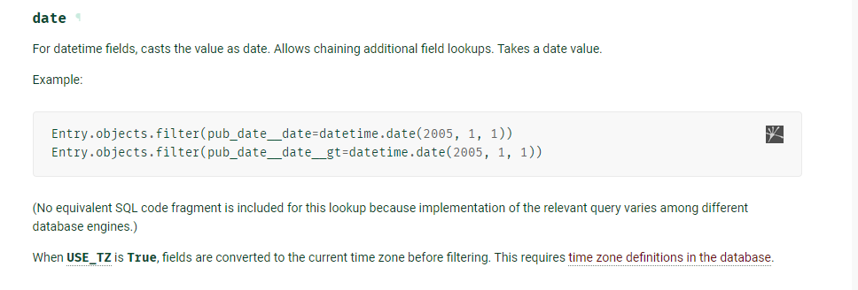

// change project interpreter: //
File -> Settings -> ChooseYourProject -> Interpreter

Choose add new and select "virtual environment".
Then choose the python version you want to use.
Make sure that python is in your windows Path

// Required packages: //
1) pip install django
2) pip install djangorestframework
3) python -m pip install -U channels
4) pip install channels-redis # if you want redis in windows you need to install it on WSL ubuntu
5) pip install django-cors-headers
6) pip install requests
7) pip install plotly==5.13.1 # for plotting

If virtual env has authorization error type in powershell:
 --> Set-ExecutionPolicy -Scope CurrentUser -ExecutionPolicy Unrestricted   //  -Force (maybe needed)
 or --> Set-ExecutionPolicy -ExecutionPolicy RemoteSigned -Scope CurrentUser

// how to run: //
cd server
python manage.py runserver

In order to connect to the server from your local network run:
--> python manage.py runserver 0.0.0.0:8000 // and then connect to the ip of the machine to the specified port
!!!Make sure the Firewall is allowing the connection (allow both python and pycharm)!!!
in the settings.py of the server add 
ALLOWED_HOSTS = ["*"]
At the end of the file.

To allow access to the Rest api without a user connection add the following to settings.py

REST_FRAMEWORK = {
    'DEFAULT_PERMISSION_CLASSES': [
        'rest_framework.permissions.AllowAny'  # 'rest_framework.permissions.IsAuthenticated',
    ]
}

// making database Migrations
python manage.py makemigrations
python manage.py showmigrations
python manage.py migrate

// Django Database

-- filter by date

Entry.objects.filter(pub_date__date=datetime.date(2005, 1, 1))
Entry.objects.filter(pub_date__date__gt=datetime.date(2005, 1, 1))